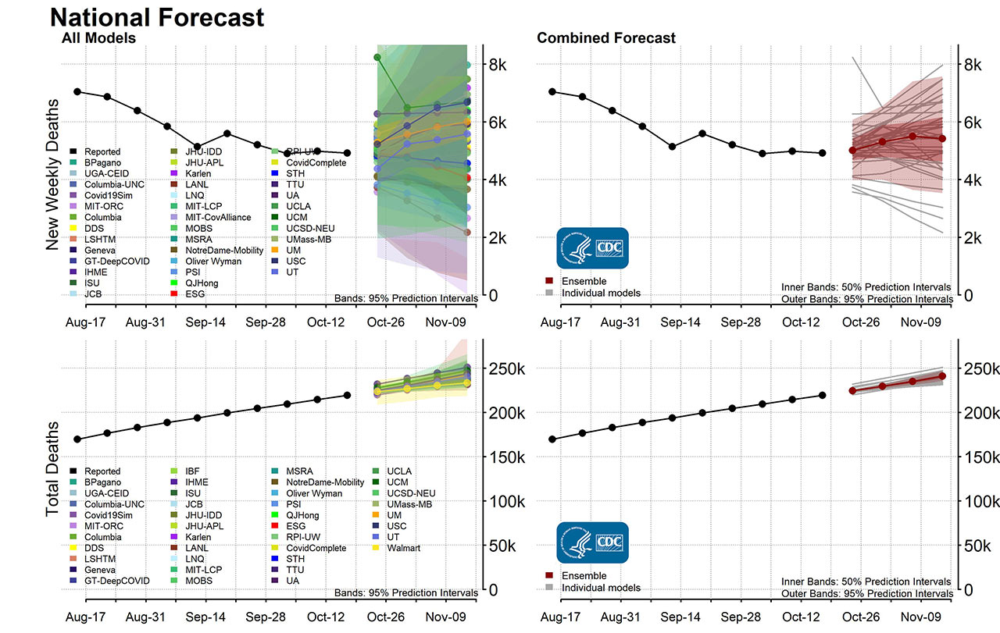

# covid data tracker

This project aggregates data from JHU's covid tracking project in order to estimate the probability of encountering a covid-19 in daily life. The aim here is to provide an annualized 'risk score' that can be used to make sensible decisions about social interactions.


## What is it doing?

Data is loaded from JHU's covid tracker into a database. This data is joined with population data for counties, states, and countries to populate a pair of tables with case data and location data. 

Here is an example of the JHU dataset:

https://github.com/CSSEGISandData/COVID-19/blob/master/csse_covid_19_data/csse_covid_19_daily_reports/04-08-2020.csv

Case data is reported by location, and aggregated up from the local level to larger administrative or political divisions. In the US this is by country, then by state, then the whole country. In other countries the data is collected by state or province. 

For each location we attempt to get a population figure. Population is important because it normalizes the case data between locations with different densities. This dataset is missing about 4.5 billion people, which hurts estimation of the risk factors. But for the US, comprehensive population data is currently available, populated from a census department CSV. Note that the locations database uses a single table that is not normalized. Empty values are used to determine the political division of a record in a databes - meaning, if 'country' and 'state' are populated, but 'county' is not, it's a population record for the state.


# APIs


## /location

The location API provides access to the locations DB table. 

        /location

        ?country
        ?state
        ?county

Multiple values for a query parameter are supported. Values within the same field are ORed together, while different fields are ANDed together.


        /location?country=US&country=Canada
        country IN ('US' or 'CA')

        /location?country=US&state=Florida&state=Georgia&state=Tennessee&county=Putnam
        country IN ('US') AND state IN ('FL', 'GA', 'TN') AND county IN ('Putnam')

The API returns an array of locations. If population is known the value will be set to a positive integer.

    http://localhost:5000/location?country=Mexico
    [
      {
        "combined": "Zacatecas, Mexico",
        "country": "Mexico",
        "county": "",
        "fips": "",
        "id": 7056,
        "lat": 22.7709,
        "lon": -102.5832,
        "pop": -1,
        "state": "Zacatecas"
      },
      {
        "combined": "Mexico",
        "country": "Mexico",
        "county": "",
        "fips": "",
        "id": 6699,
        "lat": 23.6345,
        "lon": -102.5528,
        "pop": 128649565,
        "state": ""
      }
    ]


## /cases

The cases API provides case data for a specified location, plus some computed data on the trends within that location.

        /cases

        ?country 
        ?state
        ?county 

        ?case_duration 
        ?cgr_window 

Location queries for case data work the same as location queries for the location API. Two additional parameters are included in the case data query:

`case_duration` is an estimate of the amount of time in days that an individual is infected with Covid-19. This is used to estimate the total number of "active cases" for a given query. It defaults to 14 days. The number of active cases is useful because it provides the ability to estimate a total number of infectious individuals within the given population.

`cgr_window` is the number of days for which a compound daily growth rate will be computed. The compoung growth rate (CGR) is computed against the active cases, not total cases, so the output of this value depends on the selected `case_duration`. The equation is fairly simple.

        (current_cases/starting_cases) ^ (1/cgr_window)

As an example of this, let's look at Denver CO numbers for Oct 25th.

        Date       - Active Cases
        2020-10-14 - 1863
        2020-10-15 - 1909
        2020-10-16 - 1997 * starting_cases
        2020-10-17 - 2063 
        2020-10-18 - 2136
        2020-10-19 - 2223
        2020-10-20 - 2216
        2020-10-21 - 2251
        2020-10-22 - 2294
        2020-10-23 - 2343 * current_cases
        2020-10-24 - 2451  

        CGR = (2343/1997) ^ (1/7) = 1.0230891066405975208184104654037

This means that since 10/17, the daily growth rate in cases has been `2.3089%`. This doesn't tell us how many people the typical person will infect (the "R nought" value), but it does provide a simple way of estimating tomorrow's cases.

        2343 * 1.023089 = 2397 (actual 2451)


You can see that this estimate is lower than the actual 2451 cases Denver recorded on Oct 24. In fact, the CGR for Oct 24 went up `2.4925%`. The change in compound growth rate over time reveals how well (or poorly) Covid transmission is being controlled. When the compound growth rate goes up, control over transmission is getting worse. When it goes down, the situation is improving. The important bit is that this value is a description of the way things are, and not an attempt to predict the future.

One other note here - values for CGR lower than 7 days tend to reveal an oscillation in CGR - this is caused by the way test results are reported. More reports on weekdays, fewer on weekends, means each weekend has a "false recovery" followed by a spike in cases on the weekdays.


### Why not R-Naught?

Discussions surrounding the reproductive rate or effective reproductive rate tend to focus a lot on input assumptions. 
Sophisticated models exist that incorporate many techniques together to predict Rt based on some or all of the data. 
Rt.live is a great example of this, and [their model](https://github.com/rtcovidlive/covid-model/blob/master/covid/models/generative.py) is open source. 

To me it's not clear whether those models have useful predictive value. Put another way, connecting the output of the model to a real-world outcome is difficult. What makes an Rt value interesting is the size of the population and the current case load, and an individual's behavior in the context of that population. Without that context it's an academic exercise, but that context increases the stakes of publishing a model. If you get it wrong, there's blood on your hands.

Another example of the difficulty of modeling is the CDC's [published projections](https://www.cdc.gov/coronavirus/2019-ncov/covid-data/forecasting-us.html) of Covid-19 deaths. 
These incorporate data from multiple sources and output from multiple models into an ensemble model that looks a lot like Hurricane forecasting. 
Accurate over short timeframes, questionable over long ones. 
And these are epidemiological - what are the broadest negative outcomes we can expect. There's nothing individually useful about this information.

Here they're trying to predict six weeks into the future and there's a swing of 6k weekly deaths across the whole collection of models.




        


# Building and Running the Code


This has an API and a client component. 

To run the API you need a database and a python environment.

Database is handled in a separate repo.  Postgres, with user `covid` and db `covid`. Password should be stored in `.password`, which will not be shipped to git.

I use pipenv to set up the environment:

```
        pipenv shell
        pipenv install

        # then run the script
        python load.py

        # you can load population data with load_pop
        # data was sourced from the us census bureau
        python load_pop.py
```

Once the data is loaded up, run the server using Flask

```
        FLASK_APP=server flask run
```

Client setup is handled in the client directory.


# Some other Ideas


This is a small project to stick covid-19 data into a database and compute moving averages and smoothed compound growth rates for charting. Charts might get pushed to an e-ink screen for a zero-effort daily tally (stop reading the news!).  It primarily uses data sourced from JHU. 

One piece that is maybe different from other efforts is that I'll be attempting to generate a covid-19 forecast. This would be similar to the allergen or air quality forecasts that people can access today, only instead of figuring quality of life it would be estimating the probability of your contracting covid-19 on any given day.

Guessing the forecast would combine data from multiple sources. First, an estimate of social interactivity that is a function of the weather, day of the week, time of day, and maybe whether it's a holiday. This would be a broad estiamte of how many people are out of the house and moving around on any given day.

Second, an estiamte of the current covid-19 case load in an area. This would be a ratio like the cases-per-100k that epedimiologists use today. The estimate would be based on trajectory from prior days' data - is the compound growth rate growing or slowing, what was the last known case count, and how many cases do we estimate are resolved. Possibly also hospital capacity, as that is a significant factor in covid-19 outcomes.

These two pieces of information together would provide the ability to approximate the odds of contracting covid-19 on any given day. We could present this on a scale of 0 - 100. 100 would not mean 100% odds of catching covid-19 that day, but it might mean that if you were to go outside every day for a year, you would be guaranteed to catch covid-19 with 99.99% probability. 

This would enable governments to make recommendations about social distancing that are based on realtime case data and observations. Individuals would be able to make informed choices based on their individual risk tolerance. Recommendations can be made for individuals within certain age ranges or with certain health conditions that would enable them to manage their personal risk, while others can make choices that represent their needs.

If hospitals start to get crowded, the score goes up. If the disease spread acclerated, the score goes up. On weekends, when lots of people don't have work obligations, the score might be higher. Broadcast this to everyone and it's a powerful tool for incentivizing all of society to behave in ways that strike the right balance between economic productivity and health. 


The colorado dataset reports on hospitalizations which imo is a great metric. Hospital admissions is an indicator of the case rate that is independent of testing capacity. Unfortunately the JHU data doesn't have this.

what is next?

- get a more complete dataset for US states 
- make a little webpage to run queries and display data
- generate a bmp from the webpage
- compound daily growth rates for deaths and cases
- all-US testing capacity estimation
- index stats from various states to date-of-first case
- covid "forecast". based on case data, day of week, weather, and holiday compute a score indicating whether it's safe to go outside 
